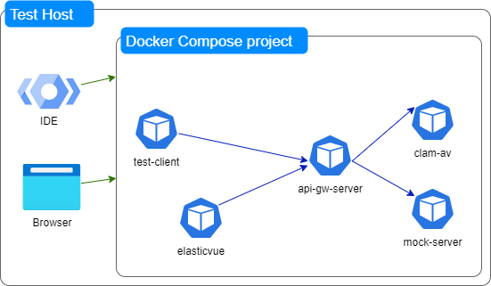

# API Gateway 10.15 Landscape test No 1

The purpose of this test is to showcase a typical API Gateway landscape, as depicted below:



The tested SUIF code is downloaded on demand on a dedicated volume mounted as `${SUIF_CACHE}`.

## Prerequisites

- Local docker and docker compose

      Note: this project is tested with Rancher Desktop using Moby engine

- GitHub project cloned locally
- Dependency GitHub projects cloned locally in separate directories
  - [WxIsTestTools](https://github.com/SoftwareAG/WxIsTestTools)
  - [SagServiceMockup](https://github.com/SoftwareAG/sag-mainstream-devops-az-03-03-api-mockup)
- The following Software AG artifacts
  - installer binary for Linux 64 bit
  - update manager bootstrap for Linux 64 bit
  - product image containing the products in the template `APIGateway/1015/default`
  - product fix image containing the latest relevant fixes for the template `APIGateway/1015/default`
  - license for API Gateway

## Quick Start

All prerequisite files are in mentioned in the file `EXAMPLE.env`.

1. Procure prerequisite Software AG files
2. Copy `EXAMPLE.env` into `.env`
3. Modify `.env` to point to your local Software AG files
4. Eventually change H_SUIF_PORT_PREFIX to avoid port conflicts

      Note: the URLs in this document assume that 

      ```sh
      H_SUIF_PORT_PREFIX=473
      ```

5. Issue docker-compose up

      Note: first run will take some time as it installs everything necessary

6. Open a browser to [localhost API Gateway UI](http://localhost:45372), or better to [host.docker.internal API Gateway UI](http://host.docker.internal:45372)
7. If you want to inspect Elasticsearch contents, go to [elasicvue home](http://host.docker.internal:45380) and then point to the ES instance at http://host.docker.internal:45320

## Reusing the scripts for other environments

This test is given as an example of on-premise installation. In a classical environment, the following steps are needed to obtain an API Gateway node

1. Provision a Linux centos / RedHat type virtual machine.
2. Ensure the software mentioned in the Dockerfile is installed
   1. `curl`, `gettext` and `which` are prerequisites, the rest are nice to have
3. Clone SUIF or copy from a clone in a folder (e.g. /home/sag/OPS/scripts/SUIF)
   1. a common initial pitfall is copying with windows end lines, please ensure all files have unix end lines
4. Prepare your own scripts mimicking the scripts in this test harness
   1. set_env.sh will contain all the variables specific to your environment
      1. Hint: don't forget to properly declare SUIF_HOME :)
   2. containerEntrypoint.sh must be adapted to your environment specifics, follow the provided sequence
      1. to install, first set the necessary environment variables as shown, then apply the template "APIGateway/1015/default"
      2. to configure post install, apply the post installation templates as shown in the example
